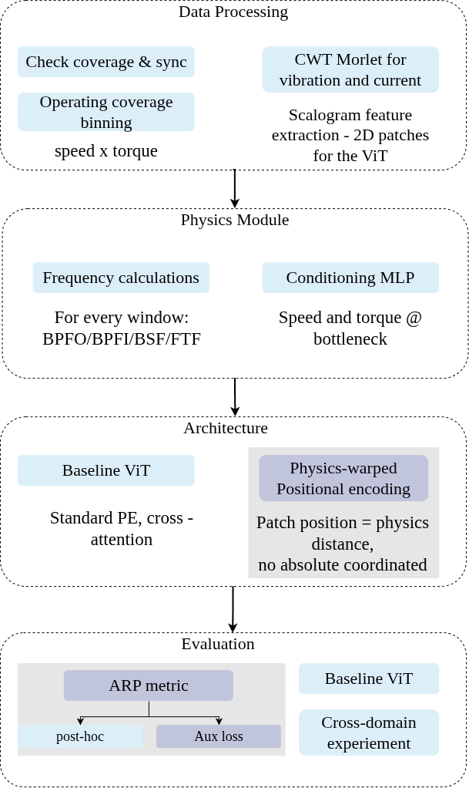
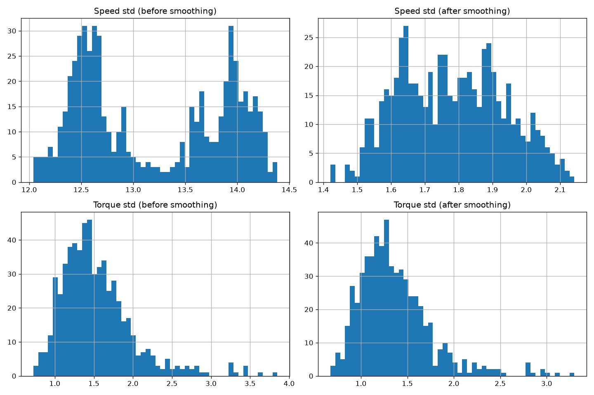
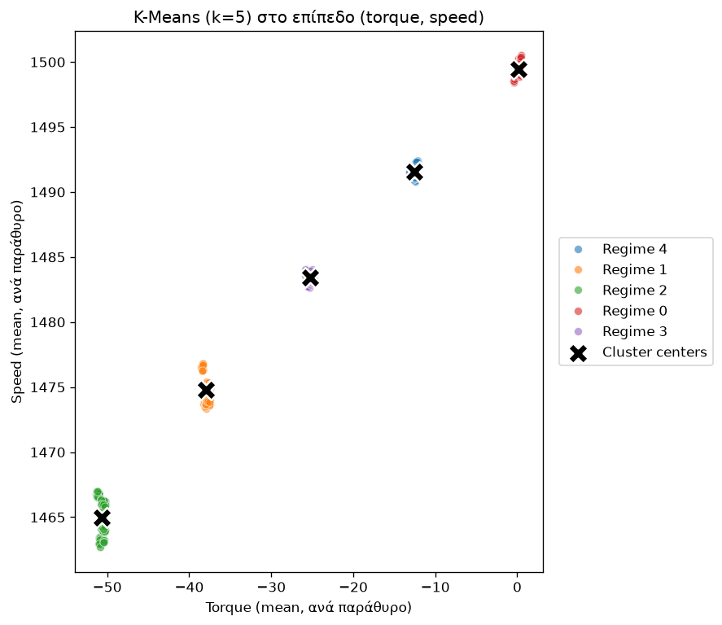
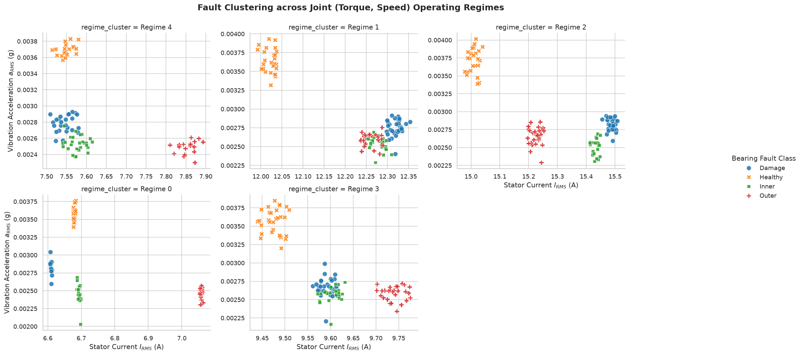

# bearing-faults

<a target="_blank" href="https://cookiecutter-data-science.drivendata.org/">
    
</a>

Predictive maintenance of bearings, using a cross-modal architecture to predict the remaining useful life of bearings based on vibration and current signals,
under different operating conditions. 

###Initial structure of methodology:



## Project Organization

```
├── LICENSE            <- Open-source license if one is chosen
├── Makefile           <- Makefile with convenience commands like `make data` or `make train`
├── README.md          <- The top-level README for developers using this project.
├── data
│   ├── external       <- Data from third party sources.
│   ├── interim        <- Intermediate data that has been transformed.
│   ├── processed      <- The final, canonical data sets for modeling.
│   └── raw            <- The original, immutable data dump.
│
├── docs               <- A default mkdocs project; see www.mkdocs.org for details
│
├── models             <- Trained and serialized models, model predictions, or model summaries
│
├── notebooks          <- Jupyter notebooks. Naming convention is a number (for ordering),
│                         the creator's initials, and a short `-` delimited description, e.g.
│                         `1.0-jqp-initial-data-exploration`.
│
├── pyproject.toml     <- Project configuration file with package metadata for 
│                         bearing_faults and configuration for tools like black
│
├── references         <- Data dictionaries, manuals, and all other explanatory materials.
│
├── reports            <- Generated analysis as HTML, PDF, LaTeX, etc.
│   └── figures        <- Generated graphics and figures to be used in reporting
│
├── requirements.txt   <- The requirements file for reproducing the analysis environment, e.g.
│                         generated with `pip freeze > requirements.txt`
│
├── setup.cfg          <- Configuration file for flake8
│
└── bearing_faults   <- Source code for use in this project.
    │
    ├── __init__.py             <- Makes bearing_faults a Python module
    │
    ├── config.py               <- Store useful variables and configuration
    │
    ├── dataset.py              <- Scripts to download or generate data
    │
    ├── features.py             <- Code to create features for modeling
    │
    ├── modeling                
    │   ├── __init__.py 
    │   ├── predict.py          <- Code to run model inference with trained models          
    │   └── train.py            <- Code to train models
    │
    └── plots.py                <- Code to create visualizations
```

## Data preprocessing 
Available data: 
20 excel sheets, each containing time series for voltage, vibration, torque, current and velocity. The data is organized in 4 folders, each corresponding to a different type of bearing condition: Damage, Healthy, Inner and Outer. Each folder contains 5 excel sheets.
```
├── Damage
│   ├── Damage_0.xlsx
│   ├── Damage_100.xlsx
│   ├── Damage_25.xlsx
│   ├── Damage_50.xlsx
│   └── Damage_75.xlsx
├── Healthy
│   ├── Healthy_0.xlsx
│   ├── Healthy_100.xlsx
│   ├── Healthy_25.xlsx
│   ├── Healthy_50.xlsx
│   └── Healthy_75.xlsx
├── Inner
│   ├── Inner_0.xlsx
│   ├── Inner_100.xlsx
│   ├── Inner_25.xlsx
│   ├── Inner_50.xlsx
│   └── Inner_75.xlsx
├── Outer
│   ├── Outer_0.xlsx
│   ├── Outer_100.xlsx
│   ├── Outer_25.xlsx
│   ├── Outer_50.xlsx
│   └── Outer_75.xlsx

```

In order to preprocess the data it is necessary to smooth the speed and torque data to avoid noise and to implement a window of 2000 samples.
The number of total windows produced are 600 (600*2000=1,200,000 samples).

For each window, the following features are extracted: 
- Mechanical features: Mean Value, Standard Deviation, torque, speed.
- Electrical features: RMS, Crest Factor, Peak to Peak Value.
- Vibration features: RMS, Crest Factor, Peak to Peak Value.
- CWT energy for current and vibration signals.

The function returns a dataframe for one line per window.

The windows produced by all files are concatenated into a single csv file.

There is a need to seperate the transient events from the steady state events. Smoothing is applied to the torque and speed signals, using a rolling mean.
The 90th percentile of the standard deviation of torque and speed is used as a threshold to filter the windows. The windows that have a standard deviation of torque and speed below the threshold are considered as steady state events.




K-means clustering is implemented to group the windows in 5 operating regimes based on their mean torque and speed. These groups are the final bins for the cross-domain split.
The decisive factor for the number of clusters is the silhouette score, which is calculated for different numbers of clusters, as well
as the elbow method. The optimal number of clusters is 5, as shown in the following figure.

The k-means algorithm is fitted to the data and the cluster centers are shown in the following figure:


the Facet grid shows how the 4 classes of data are visibly distinguishable in each of the operating regime.


--------

